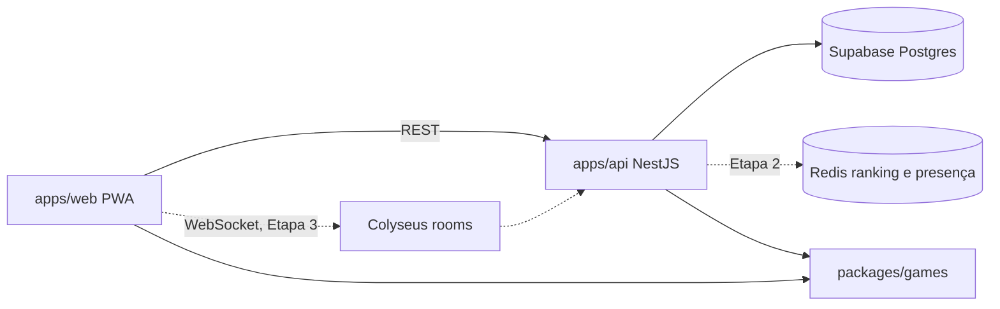

# ARCHITECTURE

Guia técnico do NoCap. Decisões de produto estão em `docs/PROJECT-BRIEF.md`; este arquivo descreve como o
código as realiza. Atualize-o no mesmo commit que mudar o comportamento descrito.

## 1. Visão

Hub de jogos para jogar com amigos (PWA). **Cada jogo é independente**: tem suas salas, regras e rankings.
Lançamento inicial: Cor e Tempo.

## 2. Monorepo

```
apps/web/         React 19 + Vite + TanStack Router/Query + Zustand + vite-plugin-pwa
apps/api/         NestJS + Drizzle ORM + postgres.js (+ Colyseus na Etapa 3)
packages/games/   lógica pura dos jogos (sem DOM, sem Node), empacotada com tsup (ESM + CJS)
packages/config/  tsconfig base
docs/             brief, roadmap, design, referências HTML, prompts
specs/            uma spec por feature
.claude/          rules, commands, skills
```

Ordem de build (Turborepo): `@nocap/games` → `@nocap/api` e `@nocap/web`. Web e api consomem
`@nocap/games/dist`; depois de editar `packages/games/src`, `pnpm dev` (watch) ou `pnpm build` atualiza.



## 3. Contrato de jogo (`packages/games`)

`GameDefinition<Settings, Round, Answer>` em `src/core/types.ts`: `id`, `meta`, `settingsSchema` (zod),
`presets`, `generateRound(seed, settings, index)` (determinístico) e `score(round, answer, settings)`
(0 a 10, 1 casa). `src/core/rng.ts` traz o PRNG com seed (mulberry32). Jogo novo = plugin em
`packages/games/src/<jogo>/` mais UI; lobby, ranking, daily, histórico e perfil não mudam.

**Anti-trapaça:** o servidor regenera as rodadas pela seed e recalcula as notas; a nota do cliente é ignorada.
Para jogos futuros com informação escondida, o contrato ganha `viewFor(state, playerId)`.

## 4. Seed e Daily

Seed string determinística. Daily: `"<game>:YYYY-MM-DD"` no fuso America/Sao_Paulo, igual para o mundo todo.

## 5. Dados (Supabase Postgres + Drizzle)

Schema em `apps/api/src/db/schema.ts`: `players`, `matches`, `match_players`, `user_game_stats`
(`head_to_head` entra na Etapa 3). **Não guardamos o alvo**, só seed e respostas (Cor: int
`h*10000+s*100+b`; Tempo: ms).

- Runtime: transaction pooler (6543) com `prepare: false` (`DATABASE_URL`).
- Migrations: session pooler (5432) via drizzle-kit (`DATABASE_URL_MIGRATIONS`).
- Retenção: detalhe das rodadas só nas últimas 200 partidas por jogo; agregados para sempre.
  Lobby, chat e eventos de sala não são salvos.

## 6. Web

- Alias `@/` para `apps/web/src`. Rotas em `src/router.tsx` (TanStack Router, code-based).
- Tokens Pop Brutal em `src/styles/tokens.css`. Ver `docs/DESIGN.md`.
- Solo roda inteiro no cliente; resultado vai para fila local (IndexedDB) e sobe quando houver rede.
- PWA: `vite-plugin-pwa` em `vite.config.ts`, `registerType: 'prompt'`.
- Variáveis `VITE_*` vêm do `.env` da raiz (`envDir: '../..'`).
- Meta: JS inicial < ~150 KB gzip, cada jogo em lazy-load.

## 7. API

Um módulo Nest por domínio, registrado em `app.module.ts`. Validação com zod. Em `apps/api`, a regra ESLint
`consistent-type-imports` fica **desligada de propósito** (quebraria `emitDecoratorMetadata`). Variáveis
vêm do `.env` da raiz, carregado em `main.ts`.

## 8. API de partidas

- `GET /games/color/daily` → `{ seed, preset }` (seed do dia em America/Sao_Paulo).
- `POST /matches` → recebe só as respostas (+ `matchId` opcional para reenvio idempotente da fila offline); regenera as rodadas pela seed, recalcula a nota, grava partida, jogador e agregados numa transação. Daily exige a seed de hoje e o modo `classic`. Responde `{ matchId, rounds:[{score}], total }`.
- `GET /players/:guestId/matches?limit&cursor` → histórico por keyset `(played_at, match_id)`, cursor opaco.
- **Unidade:** `total_score`, `score_sum` e `best` são guardados em **décimos** (500 = 50.0).
- Sem `DATABASE_URL` a API sobe; rotas com banco respondem 503.
- Pendente: aplicar a retenção (detalhe só nas últimas 200 partidas por jogo) e limitar 1 Daily por jogador por dia (com o ranking, Etapa 2).

## 9. Web: jogo da Cor

- Rotas: `/` (Hub), `/historico`, `/amigos`, `/perfil` (as três ainda "em breve") dentro de um layout com `BottomNav`; `/cor?modo=classic|flash|daily` em tela cheia, carregada sob demanda (`lazyRouteComponent`).
- `games/color/ColorGame.tsx` guarda o estado (fase, partida, resultados); cada fase é uma tela em `games/color/screens/`. Os alvos vêm de `generateColorRound(seed, ...)` do `@nocap/games`, igual ao servidor.
- Daily: a seed (`dailySeed`) é calculada no aparelho, então funciona offline. Solo: seed aleatória por partida.
- Ao fim, `submitOrQueue` tenta enviar só as respostas + `matchId` (idempotente). Sem rede ou com 5xx, a partida vai para uma fila em IndexedDB (`lib/offline-queue.ts`) e `flushQueuedMatches` reenvia ao abrir o app e no evento `online`; 4xx é descartado (reenviar nunca funcionaria).
- PWA: ícones gerados de `apps/web/public/logo.svg` (`generate-pwa-assets`), precache do shell via Workbox, fontes em cache runtime e `UpdatePrompt` (registerType `prompt`).
- `lib/sfx.ts` (Web Audio, mudo salvo no aparelho), `lib/guest.ts` (`guestId`), `lib/records.ts` (recorde local), `lib/api-client.ts` (única porta para a API).
- A barra de tempo da memorização e as contagens usam `requestAnimationFrame` (não CSS), para o tempo valer mesmo com `prefers-reduced-motion`. Com a aba em segundo plano o navegador pausa o rAF, e a rodada espera.
- JS inicial ~124 KB gzip; o jogo da Cor é um chunk à parte (~4 KB).

## 10. Estado atual

Etapa 1, passos 1 a 3 concluídos (lógica, API e UI da Cor). Próximo: PWA (passo 4), ver `docs/ROADMAP.md`.
